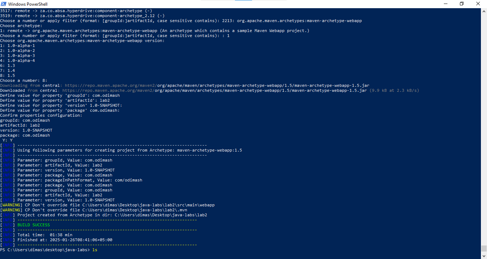
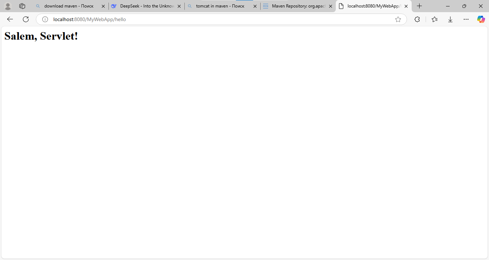

# Зертханалық жұмыс №2  
**Студент:** Османов Дінмұхаммед  
**Топ:** ВТИПО-35  
**Пән:** Java EE  

---

## Зертханалық жұмыстың тақырыбы  
Сервлеттерді қолданып веб-қолданбаны жасау және дескрипторды (`web.xml`) баптау.

---

## Жұмыстың мақсаты  
1. Java EE негізінде веб-қолданбаларды жасаудың негізгі принциптерін меңгеру.
2. Сервлеттерді жасау және баптау дағдыларын қалыптастыру.
3. `web.xml` файлының құрылымы мен мақсатын зерттеу.
4. Tomcat серверінде қолданбаны іске қосу және оны тексеру.

---

## Тапсырма  
1. Maven-жобасын веб-қолданба үшін жасау.
2. "Salem, Servlet!" хабарды шығаратын сервлетті жасау.
3. Сервлетті тіркеу үшін `web.xml` дескрипторын баптау.
4. Tomcat серверінде қолданбаны іске қосу және оны тексеру.

---

## Жұмыстың орындалуы  

### 1. Maven-жобасын жасау  
Жоба `maven-archetype-webapp` архетипінің көмегімен жасалды.  
Жобаны жасау командасы:  
```bash
mvn archetype:generate -DgroupId=com.odimash -DartifactId=lab2 -DarchetypeArtifactId=maven-archetype-webapp -DinteractiveMode=false
```

### 2. Жобаның құрылымы  
Жобаның құрылымы:  
```
lab2/
├── pom.xml
└── src/
    └── main/
        ├── java/
        │   └── com/
        │       └── odimash/
        │           └── MyFirstServlet.java
        ├── resources/
        └── webapp/
            ├── WEB-INF/
            │   └── web.xml
            └── index.jsp
```

### 3. Сервлеттің жасалуы  
"Salem, Servlet!" хабарды шығаратын `MyFirstServlet` сервлеті жасалды.  

**Сервлет коды:**  
```java
package com.odimash;

import javax.servlet.http.HttpServlet;
import javax.servlet.http.HttpServletRequest;
import javax.servlet.http.HttpServletResponse;
import java.io.IOException;
import java.io.PrintWriter;

public class MyFirstServlet extends HttpServlet {

    @Override
    protected void doGet(HttpServletRequest request, HttpServletResponse response) throws IOException {
        response.setContentType("text/html");

        PrintWriter out = response.getWriter();
        out.println("<html><body>");
        out.println("<h1>Salem, Servlet!</h1>");
        out.println("</body></html>");
    }
}
```

### 4. `web.xml` файлын баптау  
Сервлет `web.xml` файлында тіркелді.  

**`web.xml` файлының мазмұны:**  
```xml
<?xml version="1.0" encoding="UTF-8"?>
<web-app
    version="4.0"
    xmlns="http://xmlns.jcp.org/xml/ns/javaee"
    xmlns:xsi="http://www.w3.org/2001/XMLSchema-instance"
    xsi:schemaLocation="http://xmlns.jcp.org/xml/ns/javaee 
                        http://xmlns.jcp.org/xml/ns/javaee/web-app_4_0.xsd">

    <display-name>Lab2</display-name>

    <servlet>
        <servlet-name>MyFirstServlet</servlet-name>
        <servlet-class>com.odimash.MyFirstServlet</servlet-class>
    </servlet>

    <servlet-mapping>
        <servlet-name>MyFirstServlet</servlet-name>
        <url-pattern>/hello</url-pattern>
    </servlet-mapping>
</web-app>
```

### 5. Tomcat серверінде қолданбаны іске қосу  
Қолданба Tomcat серверінде іске қосылды.  

#### a) Жобаны жинау  
Жобаны WAR-файлға жинау үшін мына команда орындалды:  
```bash
mvn clean package
```

#### b) Tomcat серверінде орналастыру  
1. Жиналған WAR-файл (`lab2.war`) Tomcat серверінің `webapps` директориясына орналастырылды.  
2. Tomcat сервері іске қосылды.  

#### c) Қолданбаны тексеру  
Қолданба мына мекенжай бойынша қолжетімді:  
`http://localhost:8080/lab2/hello`  

Браузерде мына хабар көрсетілді:  
**"Salem, Servlet!"**

---

## Қорытынды  
Зертханалық жұмыс барысында:  
1. Maven көмегімен веб-қолданба жасалды.  
2. Браузерге хабар шығаратын сервлет жасалды.  
3. `web.xml` файлының құрылымы мен мақсаты зерттелді.  
4. Қолданба Tomcat серверінде сәтті іске қосылды.  

Жұмыс тапсырмаға сәйкес орындалды. Мақсаттарға қол жеткізілді.

---

## Қосымша  
### 1. `pom.xml` файлындағы тәуелділіктер  
```xml
<dependency>
    <groupId>javax.servlet</groupId>
    <artifactId>javax.servlet-api</artifactId>
    <version>4.0.1</version>
    <scope>provided</scope>
</dependency>
```

### 2. WAR-файлды жинау плагині  
WAR-файлды жинау плагині Maven-жобасында `war` упаковкасымен автоматты түрде қосылған.

---

## Скриншоттар  
1. **Жобаны құру:**  
     

2. **Жобаны іске қосу:**  
     

3. **Сервлеттің нәтижесі:**  
     